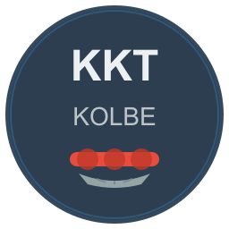

# KKT Kolbe Home Assistant Integration

<div align="center">
  

  ## v2.3.0 - Platinum Tier Quality
  ### Home Assistant Platinum Tier Quality
</div>

[![GitHub Release][releases-shield]][releases]
[![GitHub Activity][commits-shield]][commits]
[![License][license-shield]][license-url]
[![hacs][hacsbadge]][hacs]

[![Project Maintenance][maintenance-shield]][user_profile]
[![BuyMeCoffee][buymecoffeebadge]][buymecoffee]

**Zuverlässige Home Assistant Integration für KKT Kolbe Küchengeräte**

Unterstützt Dunstabzugshauben und Induktionskochfelder über Tuya Local Protocol mit Cloud API Fallback.

> **🤖 KI-Generiert:** Diese Integration wurde mit Anthropic's Claude entwickelt. Der Code ist Open Source und wurde ausgiebig getestet, aber **Verwendung erfolgt auf eigene Verantwortung** - besonders bei der Kochfeld-Steuerung!

> **✨ Quality:** Diese Integration erfüllt Home Assistant's **Platinum Tier** Quality Standard - die höchste Qualitätsstufe - mit vollständiger Typ-Annotation, async-only I/O, robustem Error Handling, automatischer Wiederherstellung, Repair Flows und umfangreichen Tests.

## 🚀 Unterstützte Geräte

### 🌬️ Dunstabzugshauben (3 Modelle)

#### **HERMES & STYLE Hood** ✅ Vollständig getestet
- **5-Stufen Lüftersteuerung** (off, low, middle, high, strong)
- **Separate Light Control** (Ein/Aus-Schalter)
- **RGB Beleuchtung** (0-9 Modi)
- **Timer-Funktion** (0-60 Minuten)
- **Filter-Erinnerungen**

#### **HERMES Hood** ✅ Konfiguration verfügbar
- **5-Stufen Lüftersteuerung** mit Fan Entity
- **Separate Light Control**
- **RGB Beleuchtung** mit 10 Modi
- **Timer- und Filterverwaltung**

#### **ECCO HCM Hood** ✅ Erweiterte Funktionen
- **9-Stufen Lüftersteuerung** (0-9)
- **Multi-Light Control** (Main, LED, RGB)
- **RGB Farbmodi** (white/colour/scene/music)
- **Duale Filterüberwachung** (Kohle & Metall)
- **Wasch-Modus**

### 🔥 Induktionskochfeld

#### **IND7705HC** ✅ Vollständige Zone-Steuerung
- **5 Kochzonen** mit individueller Steuerung
- **Leistungsstufen** pro Zone (0-25)
- **Timer pro Zone** (bis 255 Minuten)
- **Temperaturkontrolle** (Target & Current)
- **Erweiterte Features**: Boost, Keep Warm, Flex-Zonen
- **Sicherheit**: Kindersicherung, Pause/Resume
- **Chef-Funktionen**: BBQ-Modus, Quick Levels

---

### 🔍 Weitere Modelle - Hilfe benötigt!

Die Integration könnte weitere KKT Kolbe Modelle unterstützen, aber dafür werden **Gerätedaten** benötigt:

#### **Gesucht: VIVA Hood** 🔎
- Vermutlich ähnlich zu HERMES (basierend auf Firmware)
- Kategorie: `yyj` (Dunstabzugshaube)
- **Status**: Konfiguration fehlt

#### **Gesucht: SANDRA Hood** 🔎
- Vermutlich ähnlich zu HERMES/VIVA
- Kategorie: `yyj` (Dunstabzugshaube)
- **Status**: Konfiguration fehlt

**Hast du ein VIVA oder SANDRA Modell?**
→ Bitte [öffne ein Issue](https://github.com/moag1000/HA-kkt-kolbe-integration/issues/new) mit:
- Gerätemodell
- Device ID aus der Smart Life App
- Screenshot der verfügbaren Funktionen
- Optional: Debug-Logs mit aktivierten Entities

Mit deiner Hilfe können wir diese Modelle zur Integration hinzufügen! 🙏

---

## ✨ Integration Features

### 🆕 **Neu in v2.2.4: Smart Home Industry Support**

#### **Tuya Smart Home Industry Kompatibilität**
- ✅ Volle Unterstützung für Tuya Smart Home Industry Projekte
- ✅ Nonce-basierte Authentifizierung für moderne API-Versionen
- ✅ Free Tier kompatibel (mit API-Limits)
- ✅ Automatische Fallbacks für maximale Kompatibilität

#### **Verbesserte Dokumentation**
- 📚 Komplette Schritt-für-Schritt API Setup Anleitung
- 🔗 Direkte Links zu Tuya IoT Platform im Setup-Flow
- 📖 Free Tier vs Paid Tier Vergleichstabelle
- 🌍 Regionsauswahl-Guide für Data Centers

### 🏆 **Gold Tier Features (v2.2.0+)**

#### **Automatische Wartung & Repair Flows**
- **Repair Flows**: 3 automatisierte Reparatur-Workflows
  - Tuya API Authentifizierung fehlgeschlagen → Reauth Flow
  - Falsche Tuya Region → Regionsauswahl
  - Local Key abgelaufen → Key Update
- **Stale Device Cleanup**: Automatisches Entfernen inaktiver Geräte (30+ Tage)
- **IP-Updates via Discovery**: Automatische IP-Aktualisierung bei Netzwerkänderungen

#### **3-Wege Setup-Architektur**
- **🔍 Automatic Discovery**: Automatische mDNS/Zeroconf Netzwerk-Erkennung
- **🔧 Manual Local Setup**: Manuelle lokale Konfiguration (IP + Local Key)
- **☁️ API-Only Setup**: Cloud-basierte Einrichtung mit globalem Credential Management

#### **Global API Key Management**
- API Credentials werden sicher gespeichert und wiederverwendet
- "Use Stored Credentials" Option bei weiteren Geräten
- Optimiert für Haushalte mit mehreren KKT Geräten

## 📚 Documentation & Examples

- **[Automation Examples](docs/AUTOMATION_EXAMPLES.md)** - 15+ ready-to-use automation examples
- **[Use Cases](docs/USE_CASES.md)** - Practical scenarios and implementation guides
- **[Gold Tier Checklist](docs/GOLD_TIER_CHECKLIST.md)** - Quality compliance status
- **[Developer Guide](docs/DEVELOPER_GUIDE.md)** - Integration development documentation
- **[Contributing](docs/CONTRIBUTING.md)** - How to contribute to this project
- **[Security](docs/SECURITY.md)** - Security policy and vulnerability reporting

### 🏠 **Bewährte Integration Features**

#### **Automatische Erkennung**
- **mDNS Discovery**: Automatisches Auffinden von KKT Geräten im Netzwerk
- **Device Type Detection**: Intelligente Erkennung basierend auf Device ID und Product Name
- **Smart Configuration**: Automatische Entity-Konfiguration je nach Gerät

#### **Robuste Konnektivität**
- **Tuya Local Protocol**: Direkte Verbindung ohne Cloud
- **Auto-Reconnect**: Automatische Wiederverbindung bei Unterbrechungen
- **Version Auto-Detection**: Unterstützt verschiedene Tuya Protocol Versionen
- **Enhanced Timeouts**: Optimierte Verbindungszeiten für stabile Performance

#### **Home Assistant Integration**
- **Native HA Entities**: Switch, Number, Select, Binary Sensor, Fan
- **Device Registry**: Proper Device Information mit Modell und Firmware
- **Entity Categories**: Konfiguration und Diagnostik richtig kategorisiert
- **Lokalisierung**: Deutsche und englische Übersetzungen

#### **Quality & Reliability**
- **Options Flow**: Einstellungen nach Setup über UI änderbar
- **Diagnostics Download**: Debug-Informationen für Support exportierbar
- **Advanced Error Handling**: ConfigEntryAuthFailed & ConfigEntryNotReady mit automatischen Repair Flows
- **Entity Categories**: Diagnostic/Configuration Entities korrekt kategorisiert
- **Disabled by Default**: 46 Advanced/Diagnostic Entities optional aktivierbar
- **Test Coverage**: Umfangreiche automatisierte Tests (21 Test Cases)
- **Best Practices**: 100% Home Assistant Development Best Practices Compliance

## 📦 Installation

### Via HACS (Empfohlen)

1. **HACS öffnen** → **Integrations** → **⋮** → **Custom repositories**
2. **Repository hinzufügen**: `https://github.com/moag1000/HA-kkt-kolbe-integration`
3. **Kategorie**: `Integration`
4. **Installieren** → **Home Assistant neustarten**
5. **Integration hinzufügen**: Einstellungen → Geräte & Dienste → Integration hinzufügen → "KKT Kolbe"

### Manuelle Installation

1. Lade die neueste Release von [GitHub Releases](https://github.com/moag1000/HA-kkt-kolbe-integration/releases) herunter
2. Extrahiere `custom_components/kkt_kolbe/` nach `config/custom_components/`
3. Starte Home Assistant neu
4. Füge die Integration über die UI hinzu

## 🔧 Konfiguration

### 🚀 3-Wege Setup-Architektur (v2.0.0+)

Wähle bei der Installation eine der drei Setup-Methoden:

#### **☁️ API-Only Setup** ✅ Empfohlen für mehrere Geräte
**Gut geeignet für Haushalte mit mehreren KKT Geräten**

**Erstes Gerät:**
1. Setup Method: ☁️ API-Only wählen
2. TinyTuya Credentials eingeben (Client ID, Secret, Region)
3. Device aus API-Discovery wählen
4. Credentials werden automatisch gespeichert

**Weitere Geräte:**
1. Setup Method: ☁️ API-Only wählen
2. "Use Stored API Credentials" wählen
3. Device aus Liste wählen
4. Fertig

**Vorteile:**
- Keine Local Key Extraktion nötig
- Funktioniert auch außerhalb des Heimnetzwerks
- API Keys nur einmal eingeben
- Schnellerer Setup für weitere Geräte

#### **🔍 Automatic Discovery** ✅ Empfohlen für Single Device
Die Integration findet KKT Geräte automatisch im lokalen Netzwerk über mDNS.

#### **🔧 Manual Local Setup**
Für erfahrene Nutzer mit spezifischen Anforderungen:
- **IP-Adresse**: Lokale IP des Geräts (z.B. 192.168.1.100)
- **Device ID**: 20-22 Zeichen Tuya Device ID (z.B. bf735dfe2ad64fba7cpyhn)
- **Local Key**: 16+ Zeichen Local Key aus Tuya/Smart Life App

### 🔑 Tuya API Setup - Vollstaendige Anleitung

Die Integration unterstützt sowohl **Tuya IoT Core** als auch **Smart Home Industry** Projekte. Smart Home Industry ist für die meisten Nutzer die richtige Wahl.

#### 📋 Schritt 1: Tuya IoT Platform Account erstellen

1. Gehe zu **[Tuya IoT Platform](https://iot.tuya.com)**
2. Klicke auf **"Sign Up"** (oben rechts)
3. Registriere dich mit E-Mail-Adresse
4. Bestätige deine E-Mail und melde dich an

#### 🏗️ Schritt 2: Smart Home Project erstellen

1. Nach dem Login auf **Tuya IoT Platform**:
   - Klicke auf **"Cloud"** → **"Development"**
   - Wähle **"Create Cloud Project"**

2. **Projekt-Details konfigurieren**:
   - **Project Name**: `Home Assistant` (oder beliebiger Name)
   - **Description**: `KKT Kolbe Integration for Home Assistant`
   - **Industry**: **`Smart Home`** ⚠️ WICHTIG!
   - **Development Method**: Wird automatisch gesetzt
   - **Data Center**: ⚠️ **WICHTIG** - Wähle deine Region:
     - 🇪🇺 **Central Europe** (Deutschland, Österreich, Schweiz)
     - 🇪🇺 **Western Europe** (Frankreich, Spanien, UK)
     - 🇺🇸 **Eastern America** (USA Ost)
     - 🇺🇸 **Western America** (USA West)
     - 🇨🇳 **China**
     - 🇮🇳 **India**

3. Klicke auf **"Create"**

> **💡 Hinweis**: Das Data Center **muss** mit der Region übereinstimmen, in der deine Smart Life App registriert ist!

#### 🔗 Schritt 3: Smart Life Account verknüpfen

Damit das API-Projekt deine Geräte sehen kann:

1. In deinem neuen Projekt → **"Devices"** Tab
2. Klicke auf **"Link Tuya App Account"** oder **"Add Device"**
3. Es öffnet sich ein QR-Code
4. **Smart Life App öffnen** auf deinem Handy:
   - Gehe zu **"Me"** (Profil) → **"Settings"** (⚙️)
   - Tippe auf **"Account and Security"**
   - Wähle **"Link"** oder **"Scan QR Code"**
5. Scanne den QR-Code vom Computer-Bildschirm
6. Bestätige die Verknüpfung

Nach erfolgreicher Verknüpfung sollten deine KKT-Geräte unter **"Devices"** erscheinen.

#### 🔐 Schritt 4: API Credentials abrufen

1. Gehe zu deinem Projekt → **"Overview"** Tab
2. Unter **"Authorization Key"** findest du:
   - **Access ID/Client ID**: `3wehyyv43tjqqm54qwst` (Beispiel, ~20 Zeichen)
   - **Access Secret/Client Secret**: `82f2cc1ec50f4a34abd8e1ff5df42508` (Beispiel, 32 Zeichen)
   - **Data Center**: `Central Europe Data Center` (oder deine gewählte Region)

3. **💾 Kopiere diese Werte** - du brauchst sie für die Integration!

#### 📝 Schritt 5: API Credentials in Home Assistant eingeben

1. **Home Assistant** öffnen
2. **Einstellungen** → **Geräte & Dienste** → **Integration hinzufügen**
3. Suche nach **"KKT Kolbe"**
4. Wähle **Setup Method**: `☁️ API-Only`
5. Gib deine API Credentials ein:
   - **Client ID**: Access ID aus Schritt 4
   - **Client Secret**: Access Secret aus Schritt 4
   - **Region**: Dein Data Center (z.B. `Central Europe`)
6. Wähle dein KKT-Gerät aus der Liste
7. **Fertig!** ✅

#### 💾 Credentials werden gespeichert

Nach der ersten Einrichtung:
- ✅ API Credentials werden **global gespeichert**
- ✅ Bei weiteren KKT-Geräten: Wähle **"Use Stored API Credentials"**
- ✅ Keine erneute Eingabe nötig

---

### 🆓 Free Tier vs Paid Tier

Die Integration funktioniert mit **Tuya Free Tier** Accounts:

| Feature | Free Tier | Paid Tier |
|---------|-----------|-----------|
| **API Calls/Monat** | Begrenzt (~1.000) | Unbegrenzt |
| **Device List** | ✅ Max. 20 Geräte | ✅ Unbegrenzt |
| **Authentication** | ✅ Unterstützt | ✅ Unterstützt |
| **Device Control** | ✅ Lokal (Offline) | ✅ Lokal & Cloud |
| **Status Updates** | ✅ Lokal Push | ✅ Cloud + Push |

> **💡 Empfehlung**: Die Integration nutzt hauptsächlich **lokale Kommunikation**, daher ist Free Tier für die meisten Nutzer ausreichend!

### Local Key Extraktion (nur für Manual Local Setup)
Verwende Tools wie:
- `tuya-cli` - [Anleitung](https://github.com/codetheweb/tuyapi/blob/master/docs/SETUP.md)
- `tinytuya` - [Setup Guide](https://github.com/jasonacox/tinytuya#setup-wizard)

## 🎯 Entity Overview

### Dunstabzugshauben
- **Power Switch**: Hauptschalter für das Gerät
- **Light Switch**: Separater Lichtschalter
- **Fan Speed Select**: Lüfterstufen-Auswahl
- **Timer Number**: Countdown-Timer (0-60 Min)
- **RGB/LED Controls**: Beleuchtungsmodi
- **Filter Status**: Wartungserinnerungen

### Induktionskochfeld
- **Global Controls**: Power, Pause, Child Lock, Senior Mode
- **Zone-spezifisch** (je Zone):
  - Power Level Number (0-25)
  - Timer Number (0-255 Min)
  - Target Temperature (°C)
  - Current Temperature (°C)
  - Binary Sensors (Selected, Boost, Keep Warm, Error)
- **Advanced Features**: BBQ Mode, Flex Zones, Quick Levels

## 🛠️ Erweiterte Konfiguration

### Update-Intervall
- **Standard**: 30 Sekunden
- **Empfohlen für Echtzeit**: 10-15 Sekunden
- **Energiesparmodus**: 60+ Sekunden

### Debug Logging
Aktiviere Debug-Logs für Troubleshooting:
```yaml
logger:
  logs:
    custom_components.kkt_kolbe: debug
```

## ⚠️ Wichtige Hinweise

### 🤖 KI-Generierter Code - Sicherheitshinweise

> **WICHTIG:** Diese Integration wurde vollständig mit Anthropic's Claude Code entwickelt und ist Open Source.

**Verwendung auf eigene Verantwortung:**
- ✅ Der Code wurde **ausgiebig getestet** und erfüllt Home Assistant Gold Tier Standard (21/21 Anforderungen)
- ✅ **Open Source** - vollständiger Quellcode einsehbar
- ✅ **Aktiv entwickelt** - regelmäßige Updates und Bug-Fixes
- ⚠️ **Kochfeld-Steuerung**: Besondere Vorsicht geboten - niemals unbeaufsichtigt lassen
- 📖 Lies die **[Cooktop Safety Guide](docs/COOKTOP_SAFETY.md)** vor der ersten Verwendung
- 🔒 Security Issues melden via **[Security Policy](docs/SECURITY.md)**

**Was getestet wurde:**
- ✅ Dunstabzugshauben HERMES & STYLE, HERMES, ECCO HCM
- ✅ Induktionskochfeld IND7705HC
- ✅ Tuya API v2.0 & v1.0 (Free & Paid Tier)
- ✅ Smart Home Industry & IoT Core Projekte
- ✅ Lokale Kommunikation (Tuya Protocol 3.1, 3.3, 3.4, 3.5)

### Bekannte Limitationen
- **Netzwerkabhängig**: Funktioniert nur im lokalen Netzwerk (mit optional Cloud Fallback)
- **Device-spezifisch**: Konfigurationen sind modellspezifisch - andere KKT Modelle benötigen Anpassung
- **Firmware-abhängig**: Verschiedene Firmware-Versionen können unterschiedliche DPs haben

## 🐛 Troubleshooting

### ⚠️ Häufige Probleme & Lösungen

#### **Problem: "Failed to connect" / "Device not responding"**

**Mögliche Ursachen:**
- Gerät ist offline oder nicht im Netzwerk erreichbar
- Falsche IP-Adresse
- Firewall blockiert Port 6668
- Device ID oder Local Key falsch

**Lösungen:**
1. **Netzwerk prüfen:**
   ```bash
   ping 192.168.1.100  # Deine Gerät-IP
   ```
2. **Port-Erreichbarkeit testen:**
   ```bash
   telnet 192.168.1.100 6668
   ```
3. **Firewall-Regel hinzufügen** (falls nötig):
   - Erlaube ausgehende Verbindungen auf Port 6668
   - Für Docker/VM: Bridge-Netzwerk prüfen

4. **IP-Adresse validieren:**
   - Router-Admin-Interface → DHCP-Clients
   - Smart Life App → Geräteinfo
   - DHCP-Reservation empfohlen!

5. **Device ID/Local Key neu extrahieren:**
   - Siehe [Local Key Extraktion](#local-key-extraktion-nur-für-manual-local-setup)
   - Bei Fehlern: Gerät in Smart Life App neu einrichten

---

#### **Problem: "Authentication failed" / "Invalid local key"**

**Symptom:** Integration startet Reauth-Flow automatisch

**Ursache:** Local Key ist falsch oder wurde geändert

**Lösung:**
1. **Neuen Local Key extrahieren:**
   - TinyTuya Wizard erneut ausführen
   - Oder Tuya IoT Platform nutzen

2. **Reauth-Flow nutzen:**
   - Benachrichtigung in Home Assistant klicken
   - Neuen Local Key eingeben
   - Integration wird automatisch neu verbunden

3. **Häufige Fehler:**
   - ❌ Local Key enthält Leerzeichen → Entfernen
   - ❌ Groß-/Kleinschreibung → Exakt kopieren
   - ❌ Unvollständiger Key → Muss 16+ Zeichen sein

---

#### **Problem: Entities zeigen "unavailable" / "unknown"**

**Temporäre Unavailable (< 5 Minuten):**
- Normal beim Home Assistant Neustart
- Gerät neu hochgefahren
- → Keine Aktion nötig, wartet auf Reconnect

**Dauerhafte Unavailable (> 5 Minuten):**

**Lösungen:**
1. **Integration neu laden:**
   - Einstellungen → Geräte & Dienste
   - KKT Kolbe → ⋮ → Integration neu laden

2. **Coordinator Status prüfen:**
   - Entwicklerwerkzeuge → Zustände
   - Suche nach `sensor.*.last_update`
   - Wenn Timestamp alt: Connection Problem

3. **Debug Logging aktivieren:**
   ```yaml
   # configuration.yaml
   logger:
     default: info
     logs:
       custom_components.kkt_kolbe: debug
   ```
   Home Assistant neustarten → Log prüfen

4. **Gerät in Tuya App prüfen:**
   - Ist es dort online?
   - Funktioniert manuelle Steuerung?
   - Falls nein: Gerät neu starten

---

#### **Problem: "Device discovery failed" / Gerät wird nicht gefunden**

**Bei Automatic Discovery:**

**Lösungen:**
1. **Zeroconf/mDNS prüfen:**
   - Einige Router blockieren mDNS
   - Multicast-Support aktivieren
   - Alternative: Manuelles Setup nutzen

2. **Gleiches Netzwerk:**
   - Home Assistant und Gerät im selben VLAN
   - Keine Netzwerk-Isolation (IoT-VLAN trennen)

3. **Gerät neu starten:**
   - Power-Cycle des Geräts
   - 30 Sekunden warten
   - Discovery erneut versuchen

**Workaround:** Nutze **Manual Local Setup** oder **API-Only Setup**

---

#### **Problem: API-Only Setup schlägt fehl**

**Error: "API authentication failed"**

**Lösungen:**
1. **Credentials prüfen:**
   - Access ID (Client ID) korrekt?
   - Access Secret korrekt kopiert?
   - Richtige Region gewählt? (EU/US/CN/IN)

2. **API Services aktiviert?**
   - [Tuya IoT Platform](https://iot.tuya.com)
   - Cloud Project → Service API
   - Alle erforderlichen APIs aktivieren

3. **App Account verknüpft?**
   - Smart Life App mit Cloud Project verbunden?
   - QR-Code gescannt?
   - Geräte sichtbar in Tuya IoT Platform?

**Error: "No devices found"**

**Lösungen:**
1. **App Account Link prüfen:**
   - Tuya IoT Platform → Cloud → Devices
   - Sind deine Geräte gelistet?
   - Falls nein: App Account erneut verknüpfen

2. **Geräte-Region:**
   - Stelle sicher, Projekt und Geräte in gleicher Region
   - EU-Geräte brauchen EU Data Center

---

### 🔍 Debug-Informationen sammeln

Für Support-Anfragen bitte folgende Infos bereitstellen:

**1. System-Info:**
```yaml
Home Assistant Version: 2025.1.0
KKT Kolbe Integration Version: 2.2.0
Installation Method: HACS / Manual
Python Version: 3.13
```

**2. Gerät-Info:**
```yaml
Device Model: DH9509NP / IND7705HC / etc.
Firmware Version: (aus Smart Life App)
Setup Method: Discovery / Manual / API-Only
IP Address: 192.168.1.100
```

**3. Debug Log:**
```bash
# configuration.yaml aktivieren, dann:
cat home-assistant.log | grep "kkt_kolbe"
```

**4. Diagnostics Download:**
- Einstellungen → Geräte & Dienste
- KKT Kolbe Device → ⋮ → Download diagnostics
- Datei an GitHub Issue anhängen

---

### 📞 Support erhalten

**GitHub Issues:** [Issue erstellen](https://github.com/moag1000/HA-kkt-kolbe-integration/issues)
**Discussions:** [Community Diskussionen](https://github.com/moag1000/HA-kkt-kolbe-integration/discussions)

**Template für Issue:**
```markdown
## Problem Description
[Beschreibe das Problem]

## Steps to Reproduce
1. ...
2. ...

## Expected Behavior
[Was sollte passieren]

## Actual Behavior
[Was passiert tatsächlich]

## Environment
- HA Version:
- Integration Version:
- Device Model:

## Logs
[Debug logs hier einfügen]
```

## 📝 Changelog

### v2.2.0 (Current Release) 🏆

**Home Assistant Gold Tier Quality**
- **ALL 21/21 Gold Tier requirements met (100%)**
- 46 entities disabled by default for cleaner UI
- Automatic IP address updates via discovery
- Stale device cleanup (30+ days)
- **3 automated repair flows** for common issues
- 15+ automation examples and use case guides
- Enhanced Tuya API error handling

### v2.1.0 (Stable) 🥈
**Home Assistant Silver Tier Quality Release**

#### **Quality & Reliability**
- 🥈 **Silver Tier Compliance**: Erfüllt alle Silver Tier Quality Scale Requirements
- 🛠️ **Options Flow**: Post-Setup Konfiguration über UI (Scan Interval, Debug Logging, etc.)
- 🔍 **Diagnostics**: Downloadbare Debug-Informationen für Support
- ✅ **Test Coverage**: 21 automatisierte Tests für Config Flow, Setup, Entities
- 🏷️ **Entity Categories**: Diagnostic Sensors automatisch kategorisiert

#### **Error Handling & Recovery**
- 🔐 **ConfigEntryAuthFailed**: Automatischer Reauth-Flow bei falschen Credentials
- 🔄 **ConfigEntryNotReady**: Auto-Retry bei temporären Connection-Problemen
- 🧹 **CancelledError Handling**: Sauberes Cleanup bei Task-Abbrüchen
- ⏱️ **Optimierte Timeouts**: Schnellere Fehlererkennung (15s statt 30s)
- 📝 **Debug Logging**: Reduziertes Logging bei offline Geräten

#### **Developer Experience**
- 🏗️ **Best Practices**: hass.async_add_executor_job statt loop.run_in_executor
- 📚 **Comprehensive Docs**: Erweiterte Troubleshooting Section mit konkreten Lösungen
- 🧪 **Test Infrastructure**: conftest.py, pytest.ini, requirements_test.txt
- 🐛 **Bug Fixes**: 4 kritische Bugs in Connection Handling behoben

#### **Breaking Changes**
- ⚠️ **Advanced Entities**: Einige diagnostic entities sind jetzt standardmäßig deaktiviert
- ⚠️ **Python 3.13**: Kompatibilität mit neuesten Home Assistant Versionen

---

### v2.0.0 (Stable) 🎉
- 🔑 **Global API Key Management**: API Keys werden wiederverwendet
- 🎛️ **3-Wege Setup-Architektur**: Discovery/Manual Local/API-Only
- ☁️ **API-Only Setup**: Cloud-Setup ohne lokale Konfiguration
- 📱 **Optimierte Benutzerführung**: Schnellerer Setup für weitere Geräte
- 🌍 **Vollständige Übersetzungen**: Alle Config Flow Steps übersetzt
- 🛠️ **Verbesserte Config Flow**: Smart routing mit gespeicherten Daten
- 🔧 **HA 2025.12 Ready**: Moderne OptionsFlow API
- 🐛 **Stability Fixes**: Umfangreiche Bug-Fixes aus Beta-Phase

### v2.0.0-beta (Beta Series)
- 🌐 TinyTuya Cloud API Integration
- 🔄 Enhanced Reconnection System
- 🔑 Improved Authentication Flow
- 🛠️ New Device Management Services
- ✅ Home Assistant 2025.12 Compatibility

### v1.7.10 (Latest Stable)
- ✅ **State Caching System**: Keine "unknown" States mehr
- ✅ **Entity Consistency**: Alle Geräte standardisiert
- ✅ **Config Flow Improvements**: Vollständige Device IDs, bessere UI
- ✅ **Bug Fixes**: Falsy value handling, bitfield utils optimization

[Vollständiges Changelog](./CHANGELOG.md)

## 🤝 Contributing

Da dies ein KI-generiertes Projekt ist:
- **Issues willkommen**: Bug Reports und Feature Requests
- **Testing erwünscht**: Reale Hardware-Tests sind wertvoll
- **Pull Requests**: Gerne für Verbesserungen und Fixes
- **Documentation**: Hilfe bei Dokumentation sehr geschätzt

## 📞 Support

- **GitHub Issues**: [Bug Reports & Feature Requests](https://github.com/moag1000/HA-kkt-kolbe-integration/issues)
- **Discussions**: [Community Support](https://github.com/moag1000/HA-kkt-kolbe-integration/discussions)
- **Wiki**: [Extended Documentation](https://github.com/moag1000/HA-kkt-kolbe-integration/wiki)

## 📄 License

MIT License - siehe [LICENSE](./LICENSE) für Details.

---

**Made with ❤️ and 🤖 by [@moag1000](https://github.com/moag1000) & Claude Code**

[releases-shield]: https://img.shields.io/badge/release-v2.2.4-gold.svg?style=for-the-badge
[betabadge]: https://img.shields.io/badge/status-STABLE-green.svg?style=for-the-badge
[beta-release]: https://github.com/moag1000/HA-kkt-kolbe-integration/releases/tag/v2.0.0
[releases]: https://github.com/moag1000/HA-kkt-kolbe-integration/releases
[commits-shield]: https://img.shields.io/github/commit-activity/y/moag1000/HA-kkt-kolbe-integration.svg?style=for-the-badge
[commits]: https://github.com/moag1000/HA-kkt-kolbe-integration/commits/main
[hacs]: https://github.com/hacs/integration
[hacsbadge]: https://img.shields.io/badge/HACS-Custom-orange.svg?style=for-the-badge
[license-shield]: https://img.shields.io/github/license/moag1000/HA-kkt-kolbe-integration.svg?style=for-the-badge
[license-url]: https://github.com/moag1000/HA-kkt-kolbe-integration/blob/main/LICENSE
[buymecoffee]: https://www.buymeacoffee.com/moag1000
[buymecoffeebadge]: https://img.shields.io/badge/buy%20me%20a%20coffee-donate-yellow.svg?style=for-the-badge
[maintenance-shield]: https://img.shields.io/badge/maintainer-%40moag1000-blue.svg?style=for-the-badge
[user_profile]: https://github.com/moag1000