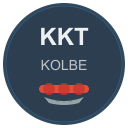

# KKT Kolbe Home Assistant Integration

<div align="center">
  

  **Home Assistant Integration für KKT Kolbe Küchengeräte**

  [![GitHub Release][releases-shield]][releases]
  [![HACS][hacsbadge]][hacs]
  [![License][license-shield]][license-url]
  [![Validate][validate-shield]][validate]
  [![Commit Activity][commits-shield]][commits]

  [![Buy Me A Coffee][coffee-shield]][coffee]

  *Dunstabzugshauben und Induktionskochfelder lokal steuern*
</div>

---

## Highlights v4.3.0

- **SmartLife Info Sensor** - Erweiterte Geräteinformationen und Entity Picture
- **Fan Auto-Start unterdrücken** - Option um Lüfter beim Einschalten der Haube zu blockieren
- **Device ID Change Repair** - Automatische Erkennung & Reparatur bei Gerätewechsel
- **Kein Developer Account nötig** - Setup via SmartLife/Tuya Smart App
- **Auto-Power-On** - Hood schaltet automatisch ein bei Fan/Licht-Steuerung
- **Lokale Steuerung** - Tuya Protocol ohne Cloud-Abhängigkeit
- **6 Dunstabzugshauben + 1 Kochfeld** unterstützt, Backofen in Vorbereitung

> **Hinweis:** Diese Integration wurde mit [Claude Code](https://claude.ai/code) entwickelt. Der Quellcode ist vollständig einsehbar. Verwendung auf eigene Verantwortung.

---

## Quick Start

```
1. SmartLife/Tuya Smart App installieren → KKT-Gerät hinzufügen
2. App: Ich → Einstellungen → Konto und Sicherheit → User Code kopieren
3. Home Assistant: Integration hinzufügen → "KKT Kolbe"
4. User Code eingeben → QR-Code mit App scannen → Fertig!
```

**[Ausführliche Anleitung →](docs/SMARTLIFE_SETUP.md)**

---

## Unterstützte Geräte

### Dunstabzugshauben

| Modell | Lüfter | Licht | RGB | Timer | Status |
|--------|--------|-------|-----|-------|--------|
| **HERMES & STYLE** | 5 Stufen | Helligkeit | 10 Modi | ✅ | ✅ Getestet |
| **HERMES** | 5 Stufen | Helligkeit | 10 Modi | ✅ | ✅ Verfügbar |
| **ECCO HCM** | 9 Stufen | Multi | 4 Modi | ✅ | ✅ Verfügbar |
| **SOLO HCM** | 9 Stufen | Multi | 4 Modi | ✅ | ✅ Verfügbar |
| **EASY** | 10 Stufen | ✅ | 10 Modi | ✅ | ✅ Verifiziert (Issue #5) |
| **FLAT** | 5 Stufen | ✅ | - | ✅ | ✅ Verfügbar |

EASY-Modelle: EASY9005SM (90cm), EASY909SHCM (90cm), EASY609SHCM (60cm) - HERMES-basiert mit 10 Lüfterstufen

### Induktionskochfeld

| Modell | Zonen | Features | Status |
|--------|-------|----------|--------|
| **IND7705HC** | 5 | Power 0-25, Timer, Temp, Boost, Flex | ✅ Getestet |

### Backofen (in Vorbereitung)

| Modell | WiFi | Status |
|--------|------|--------|
| **EB8313HC** | Tuya/SmartLife | DPs unbekannt - Tester gesucht |
| **EB8317HC** | Tuya/SmartLife | DPs unbekannt - Tester gesucht |
| **EB8313ED** | Tuya/SmartLife, Kerntemperaturfühler | DPs unbekannt - Tester gesucht |

Die Backofen-Unterstützung ist vorbereitet, aber die Tuya Data Points (DPs) sind noch nicht
mit einem echten Gerät verifiziert. Falls du einen dieser Backöfen besitzt, hilf uns die
korrekten DPs zu ermitteln: [Issue erstellen](https://github.com/moag1000/HA-kkt-kolbe-integration/issues/new?template=new_device.md)

### Weitere Geräte gesucht

Hast du ein KKT Kolbe Gerät mit WiFi das hier nicht aufgeführt ist?
[Issue erstellen](https://github.com/moag1000/HA-kkt-kolbe-integration/issues/new?template=new_device.md)

---

## Installation

### Via HACS (Empfohlen)

1. HACS → Integrations → ⋮ → Custom repositories
2. URL: `https://github.com/moag1000/HA-kkt-kolbe-integration`
3. Kategorie: Integration → Installieren → Neustarten

### Manuell

```bash
# Download & Extract nach config/custom_components/kkt_kolbe/
```

---

## Setup-Methoden

| Methode | Developer Account | Schwierigkeit | Empfohlen |
|---------|-------------------|---------------|-----------|
| **SmartLife QR-Code** | Nein | Einfach | ✅ |
| IoT Platform API | Ja | Mittel | - |
| Manual (tinytuya) | Nein | Schwer | - |

**[SmartLife Setup →](docs/SMARTLIFE_SETUP.md)** | **[tinytuya Guide →](known_configs/tinytuya_cloud_api_guide.md)** | **[Developer Guide →](docs/DEVELOPER_GUIDE.md)**

---

## Voraussetzungen

| Komponente | Version |
|------------|---------|
| Home Assistant | ≥ 2025.12.0 |
| Python | ≥ 3.12 |

---

## Dokumentation

| Thema | Link |
|-------|------|
| SmartLife Setup | [docs/SMARTLIFE_SETUP.md](docs/SMARTLIFE_SETUP.md) |
| Troubleshooting | [TROUBLESHOOTING.md](TROUBLESHOOTING.md) |
| Blueprints | [blueprints/README.md](blueprints/README.md) |
| HomeKit Integration | [docs/HOMEKIT.md](docs/HOMEKIT.md) |
| Automation Examples | [docs/AUTOMATION_EXAMPLES.md](docs/AUTOMATION_EXAMPLES.md) |
| Developer Guide | [docs/DEVELOPER_GUIDE.md](docs/DEVELOPER_GUIDE.md) |
| Changelog | [CHANGELOG.md](CHANGELOG.md) |

---

## Bekannte Limitationen

- Funktioniert nur im lokalen Netzwerk (optional Cloud-Fallback)
- Modell-spezifische Konfigurationen
- Firmware-abhängige Data Points

---

## Entwicklung & Quellen

### Verwendete Bibliotheken

| Bibliothek | Zweck | Lizenz |
|------------|-------|--------|
| [tinytuya](https://github.com/jasonacox/tinytuya) | Tuya Local Protocol | MIT |
| [tuya-device-sharing-sdk](https://github.com/tuya/tuya-device-sharing-sdk) | SmartLife QR-Code Auth | MIT |
| [pycryptodome](https://github.com/Legrandin/pycryptodome) | Tuya Encryption | BSD |

### Referenzen & Inspiration

- [Home Assistant Developer Docs](https://developers.home-assistant.io/)
- [Home Assistant Core Integrations](https://github.com/home-assistant/core/tree/dev/homeassistant/components)
- [Tuya Official Integration](https://github.com/home-assistant/core/tree/dev/homeassistant/components/tuya)
- [LocalTuya](https://github.com/rospogriern/localtuya) - Tuya Protocol Patterns
- [TuyaLocal](https://github.com/make-all/tuya-local) - Device Configurations

### KI-Entwicklung

Diese Integration wurde vollständig mit **[Anthropic Claude](https://anthropic.com)** entwickelt:
- Architektur-Design und Code-Generierung
- Test-Erstellung und Dokumentation
- Code Reviews und Optimierungen

Der gesamte Quellcode ist Open Source und einsehbar.

---

## Contributing

- **Bug Reports**: [Issue erstellen](https://github.com/moag1000/HA-kkt-kolbe-integration/issues)
- **Feature Requests**: [Discussion starten](https://github.com/moag1000/HA-kkt-kolbe-integration/discussions)
- **Pull Requests**: Willkommen!
- **Hardware Tests**: Besonders wertvoll!

---

## Support

| Kanal | Link |
|-------|------|
| GitHub Issues | [Bug Reports](https://github.com/moag1000/HA-kkt-kolbe-integration/issues) |
| Discussions | [Community](https://github.com/moag1000/HA-kkt-kolbe-integration/discussions) |

---

## Lizenz

MIT License - siehe [LICENSE](./LICENSE)

---

<div align="center">

**Made with ❤️ and 🤖 by [@moag1000](https://github.com/moag1000) & [Claude Code](https://claude.ai/code)**

</div>

[releases-shield]: https://img.shields.io/github/v/release/moag1000/HA-kkt-kolbe-integration?style=for-the-badge
[releases]: https://github.com/moag1000/HA-kkt-kolbe-integration/releases
[validate-shield]: https://img.shields.io/github/actions/workflow/status/moag1000/HA-kkt-kolbe-integration/validate.yml?style=for-the-badge&label=Validate
[validate]: https://github.com/moag1000/HA-kkt-kolbe-integration/actions/workflows/validate.yml
[hacs]: https://github.com/hacs/integration
[hacsbadge]: https://img.shields.io/badge/HACS-Custom-orange.svg?style=for-the-badge
[license-shield]: https://img.shields.io/github/license/moag1000/HA-kkt-kolbe-integration.svg?style=for-the-badge
[license-url]: https://github.com/moag1000/HA-kkt-kolbe-integration/blob/main/LICENSE
[commits-shield]: https://img.shields.io/github/commit-activity/m/moag1000/HA-kkt-kolbe-integration?style=for-the-badge
[commits]: https://github.com/moag1000/HA-kkt-kolbe-integration/commits/main
[coffee-shield]: https://img.shields.io/badge/Buy%20Me%20A%20Coffee-FFDD00?style=for-the-badge&logo=buy-me-a-coffee&logoColor=black
[coffee]: https://buymeacoffee.com/moag1000
